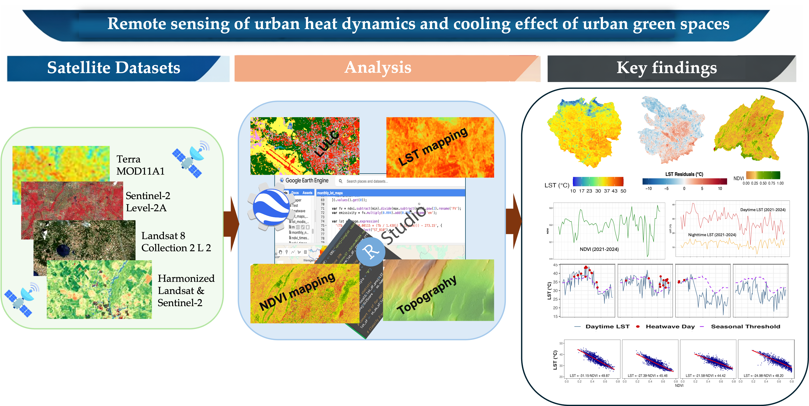

## Remote sensing of urban heat dynamics and vegetation cooling effects in Ethiopian cities

Authors: Desalew Meseret Moges, Kristoffer Mattisson, Ebba Malmqvist, Per-Ola Olsson

## Abstract

Urban heat stress has become a major challenge in the context of rapid urbanization and climate change, posing risks to public health and urban livability. Green spaces are widely recognized as a key strategy for mitigating urban heat. However, understanding how thermal dynamics interact with vegetation across different urban forms remains essential yet underexplored. In this study, we utilize satellite-derived datasets to analyze the spatiotemporal patterns of urban heat and vegetation cover, as well as their interactions, during the hot season between 2020 and 2024 across four Ethiopian cities: Addis Ababa, Adama, Jimma, and Harar, representing diverse urban morphologies and climatic conditions. Our findings show an increase in vegetation cover in all cities over the study period, concentrating along urban fringes while remaining scarce in dense central districts, most notably in Addis Ababa and Adama. This spatial disparity highlights uneven green infrastructure distribution in highly built-up areas. Urban surface temperature showed complementary yet complex dynamics. Daytime temperature declined markedly across all cities (p < 0.001). In contrast, nighttime temperature trends were mixed, warming in Adama and Jimma but stable in Addis Ababa and Harar, leading to a contraction of the diurnal temperature range. The vegetation–temperature relationship was strong and consistent in Addis Ababa and Jimma (R² > 0.51, p < 0.001) but weak and erratic in Adama and Harar (R² < 0.10). Residual temperature analyses revealed localized hotspots not explained by vegetation alone, linked to impervious surfaces and exposed soils. Heatwave characteristics further underscored climatic divergence, with Addis Ababa and Jimma experiencing longer but moderate-duration events, whereas Harar experienced shorter yet more intense events. Overall, the results reveal emerging spatial heterogeneity in urban heat regimes and underscore the need for context-specific greening and surface management strategies to support climate-resilient urban futures in Ethiopia and beyond.

## Funding

This study was funded by the European Union's Horizon Europe Research and Innovation Programme under the ENABLE Project (Grant Agreement # 101137232). Views and opinions expressed are, however, those of the author(s) only and do not necessarily reflect those of the European Union or the Health and Digital Executive Agency (HADEA). Neither the European Union nor the granting authority can be held responsible for them. The funder of this study had no role in study design, data collection, data analysis, data interpretation, the writing of the report, or the decision to submit the manuscript for publication.
